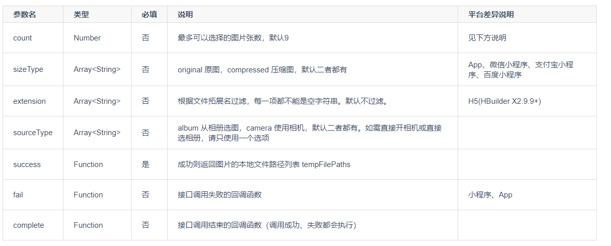
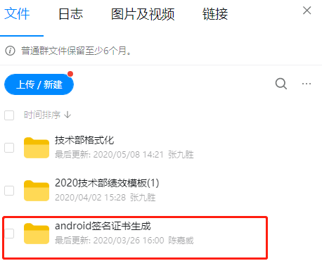
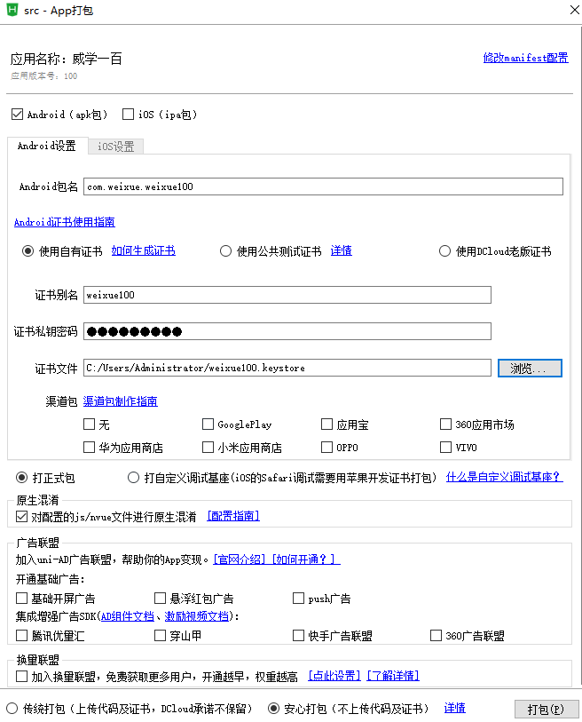
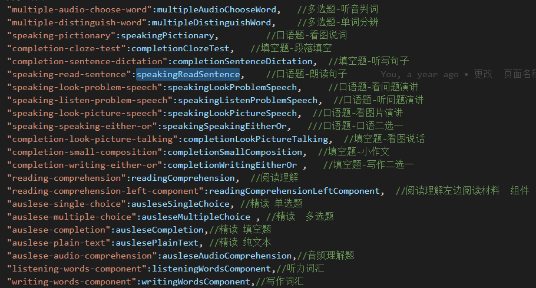
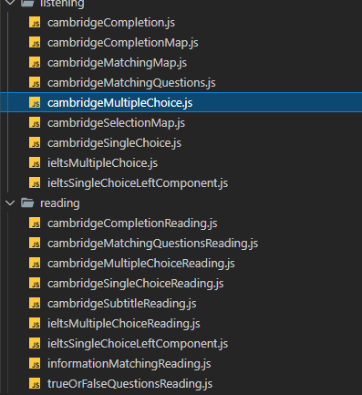

# 工作交接

## 微信小程序
---
> + 线上APPID wx85344254e9c468a7
> + pro测试APPID  wx60b483cecdb60665
> + 线上代码分支目前使用 mz 分支
> + 注意小程序的分包（目前最好一个页面做一个分包）
> + 秘钥AppSecret 找九爷拿
---
&nbsp;
+ ### 小程序学习模块及班级详情、班级作业、视频
  &nbsp;
    + 班级详情目前区分班级作业、班级课表、班级视频，后续可能会添加 班级资料 模块,添加新模块，参考如下代码即可
    ```js
    <view class="flex fcolumn hv-center rel class-type" :data-id="2" v-if="homeworkListState" @click="handleHomework">
        <view class="f24" :data-id="2" :class="selected == 2 ? 'active' : ''">班级作业</view>
        <view class="abs" :class="selected == 2 ? 'borderBottom' : ''"></view>
    </view>
    ```
  + 班级作业、课表、视频的跳转使用  *pages\homework\NavUrl\urlNavigateTo.js* 封装跳转函数跳转，作业、课表、视频跳转使用的判断参数咨询后端文档及类型判断的数据


  &nbsp;
  ===
+ ### 小程序首页课程模块及微信支付SDK
  &nbsp;
  + 通过get-detail接口获取首页模块 course-module  live-module  play-module 等模块
    ```js
    /wxapp/diy/get-detail
    ```

  + 模考使用同统一数据格式如下
    ```json
    modules: [{name: "免费直播", cate: "1", subject: "7", type: null, liveType: "0", total: "0",…},…]
    0: {name: "免费直播", cate: "1", subject: "7", type: null, liveType: "0", total: "0",…}
    1: {name: "免费视频", cate: "2", subject: "7", type: null, liveType: "", total: "2",…}
    2: {name: "热门课程", cate: "3", subject: "7", type: null, liveType: "", total: "0",…}
    ```


+  课程详情支付
  &nbsp;
    + 页面路径 `pages\course\course-detail\course-detail.vue `
    + 付费订单及免费订单都需要走创建订单接口  *courseplan/order/create-order*
    + 付费订单 需通过 *courseplan/order/get-pay*  获取支付钱包签名等信息，再调用 requestPayment 调起微信支付

&nbsp;
===
+ 小程序全局护眼模式
&nbsp;
    + 设置Storage本地缓存  protect-eye 为 `ture`

        ```js
        const value = uni.getStorageSync('protect-eye');
        ```
    +  其余全局页面需要在 子页面添加以下代码 `在页面最顶级的view元素添加如下class判断`
        ```js
        <view :class="switchChecked?'protecteye':''">
        ```
        ```js
        onShow() {
            this.switchChecked = this.$store.state.switchChecked;
        },
        ```
> 全局使用全局模式在 `pages/mine/my-setting/my-setting` 中设置


&nbsp;


 + 全局http封装函数
    +  `get post` 参数均可直接放data里传参

    ```js
     this.$http.post({url: '',data: {}})
     this.$http.get({url: '',data: {}})
    ```
&nbsp;
===
+   全科目题库

    +  集合各科目的全部题型
    +  题型层级不限不定，根据接口返回的配置确定

    >  `
      data[0].nextPageType  // 表示下页的层级
      data[0].pageType  // 当前页面的层级
      `

    >- `nextPageType pageType` 的值为2 3
    >- 值为2表示页面路径为  `pages/question-bank/question-list/question-list`
    >- 值为3表示页面路径为 `pages/question-bank/question-subject/question-subject`

    + 题库跳转逻辑使用题库封装的跳转函数  `pages\question-bank\QuestionNavUrl\QuestionNavigationTo.js`
---
## 安卓app端
----
+ 可以直接使用 `发行--原生App-云打包`快捷打包，也可使用 `android studio` 离线打包
+ 打包需要更新到最新版 `HBuilder X` 但大部分情况最新的版本会出现兼容问题 甚至是直接白屏不能运行的问题
+ 如出现白屏不能运，需要到论坛找解决方法，大概率是版更更新导致旧的语法不兼容，修改为可使用的的语法即可
+ 2.6左右的版本出现这种空的class是不影响的，2.8以后有这种语法直接白屏不运行同时也不报错，把全局空白class删除即可
    ```html
    <view class=""></view>
    ```
+ 注意区分小程序专用api及APP-PLUS专用api，app出现小程序的api会直接导致白屏不运行,如下的api为小程序专用，
    ```js
    uni.getUserInfo
    uni.getUpdateManager
    ```
+ 注意api的平台差异

  

### APP 打包
 &nbsp;
 ***
+ Android签名证书

    
   &nbsp;
***
> + 证书别名 weixue100
> + 证书秘钥密码  weixue100
***
 &nbsp;
   + 打包秘钥配置
   
---
&nbsp;

## 模考系统
---

+ ###  模考系统 课程购买模块
  > 页面路径 `/courseplan/plan/index列表页   courseplan/plan/detail详情页`
  + pc购买流程与小程序购买流程基本相同
  + 免费及付费课程全部走创建订单流程
  + 支付功能只能pro 及 线上测试 本地无法测试

  + pc 调起微信支付二维码与小程序不太一样

  ```js
  /order/order/get-pay?orderID=${orderID}
  ```
  通过以上接口获取 支付密钥字符串等信息

  调用PC微信支付SDK,同时检测是否完成支付，如完成支付及返回详情页面
  ```js
   WeixinJSBridge.invoke(
      'getBrandWCPayRequest', {
          "appId": appId, //公众号名称，由商户传入
          "timeStamp": timeStamp, //时间戳，自1970年以来的秒数
          "nonceStr": nonceStr, //随机串
          "package": page,
          "signType": "MD5", //微信签名方式：
          "paySign": paySign //微信签名
      },
      res => {
          if (res.err_msg == "get_brand_wcpay_request:ok") {
              // console.log('调起微信支付成功  ',res);
              this.h5payloading = false;
              this.checkPay(orderID);
              // 使用以上方式判断前端返回,微信团队郑重提示：
              //res.err_msg将在用户支付成功后返回ok，但并不保证它绝对可靠。
          } else {
              this.showToast('取消支付');
              this.h5payloading = false;

          }
  });
  ```
---


+ ###  模考系统 全科目词库
  + 页面路径 ` /testing/question-bank/index`
  + 跳转路径是后端配置，只负责跳转,只需要带contentID参数 后端去处理实际跳转的链接
    >- 做题url `/testing/learn/start-exercise?contentID=${id}`
    >- 查看结果url `/testing/learn/exercise-result?contentID=${id}`
    >- 视频查看url `/testing/video/watch?contentID=${id}`
  + pc全科目词汇同样是无限层级，根据返回的信息确定显示列表
---

&nbsp;

## 管理后台
---
+ ### 精读练习录题入口整合（全科目）

  > 录题入口 `/testing/exercise/edit`

  > 录题形式是单题录题的形式
  + 所有题型单独抽出来做成一个组件，降低各录题题型组件的耦合
  + 使用相同的提交接口，在 `/testing/exercise/edit` 提供各题型统一的  ` @commitdata="duoLinGoCommitDataAjax"`
  
  + 在 `duoLinGoCommitDataAjax` 中只做数据的提交，各题型的数据校验，是否必填等验证均在各题型组件中自定义校验及提示

&nbsp;
===
+ ###  剑桥雅思录题
  > 录题入口 `/ielts/listening/edit-exam-item`

  > 录题形式是整套试题试卷录题的形式

  + 阅读入口 `backend\modules\ielts\views\reading\edit-exam-item.php`
  + 听力入口 `backend\modules\ielts\views\listening\edit-exam-item.php`
  + 不同题目类型入口不一样，各题目类型下的答题类型都不太一样，所以区分每个题目下的题型的组件，全部都单独抽出封装为题型组件，封装组件如下图：
  
  + 使用相同的提交接口函数，`@update="updateExerciseData"`，须负责判断个提醒的数据判断验证
  + 数据验证与精读练习，题目数据，小题数据验证放在 `updateExerciseData`中验证，需校验当前题目类型下的答题类型的必填项目等数据
  + 剑桥雅思 阅读题型原文的富文本标记功能，使用 `highlighter` 等的插件，具体问梓豪，原理是标记之前确保文本不能在编辑需要锁定，一点需要编辑文本内容，所有题型数据均需要清除题目中所有小题的标记数据重新标记，需要清除各个题小题中的 `exerciseData[i].matches[n].attributes.mask`标记数据
